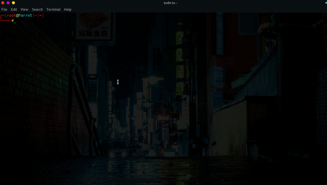

  

# NetKnife Intrusion Testing Framework
A framework for intrusion testing and intra-network attacks
Writed With Python 
Tested On Linux OS 
# Developer: AmirHossein Tangsiri Nezhad
This framework is being developed by Amir Hossein Tangsiri Nezhad

# Installation
➜  ~ git clone https://github.com/AmirHoseinTnagsiriNET/NetKnife 

➜  ~ cd NetKnife 

➜  NetKnife git:(master) python NetKnife.py 

# Tools Details 

### [1]: Arp Cache Poisiner Tools:

This tool is used to implement the Arp Cache Poisoning attack on the target

### [2]: Fake Access Point Creator Tools:

This tool is used to create fake access points

### [3]: SSID Hidden Locator Tools:

This tool is responsible for finding Wireless and Access Point devices that are hidden

### [4]: Hash Creator Tools:

This tool is used to convert Plain-Text texts to Cipher-Text texts using Hash algorithms.

### [5]: SYN Flooder Tools:

This tool is used to implement the Syn Flooding attack, which is a Denial-Of-Service attack

### [6]: Network Packet Capture Tools:

This tool is used to record ongoing traffic from the interface

### [7]: AP And WIFI Device Detection Tools:

This tool is used to detect the Mac and SSID addresses of AP and Wireless devices

### [8]: Public IP Changer In 3 Per Second:

This tool changes the general IP address of your system once every 3 seconds using the Tor service.
Note: This tool is missing on Linux systems along with System-D

### [9]: Wi-Fi Deauthentication Attacker Tools:

This tool is used to implement the Deauthentication attack on Wirelss networks

### [10]Tcp Port Scanner Tools:

This tool is used to scan Tcp protocol ports. This tool, unlike similar tools in other frameworks, has a higher scanning power

# Python 2

  

